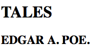
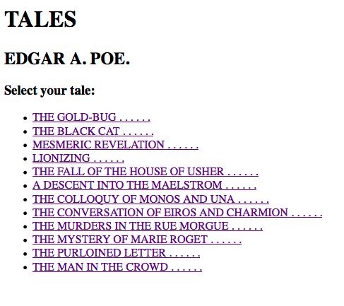
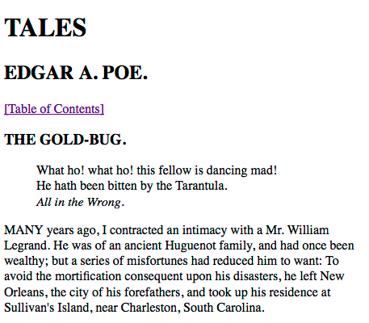

.. ==================================================
.. FOR YOUR INFORMATION
.. --------------------------------------------------
.. -*- coding: utf-8 -*- with BOM.

.. include:: ../../Includes.txt

FLUIDTEMPLATE, XPATH & XSLT
^^^^^^^^^^^^^^^^^^^^^^^^^^^

This tutorial will show you how to display a TEI encoded XML file on
your website using the XPATH content object and a FLUIDTEMPLATE. You
will learn how to select parts of the XML structure with XPATH and
assign them as variables to your FLUIDTEMPLATE. Additionally you will see
how the XPATH view helper for Fluid works. And finally we will have a
quick look at the extension `XSLT Content Object
<http://typo3.org/extensions/repository/view/cobj_xslt>`_ that can
be used to transform large chunks of XML for display on your TYPO3
website. Before we start, please make sure that you have installed
Extbase, Fluid and cobj\_xslt.

As example we will display Edgar Allan Poe's "Tales" on our TYPO3 website.
The book is offered as a TEI XML file at
`http://docsouth.unc.edu/southlit/poe/poe.xml
<http://docsouth.unc.edu/southlit/poe/poe.xml>`_ .

What we want to achieve:

- Use a FLUIDTEMPLATE as basis for the FE output

- Display the title and subtitle of the book and a table of contents

- Link the table of contents to the tales; if the user clicks on a
  story, the selected story should be displayed with a backlink to the
  table of contents

- Transform the selected story's XML text to HTML using a XSL
  transformation

Let's have a look at the XML structure and consider some basic things:

- We can get the title and author from the data inside the <titlePage>
  tag. This is basically static information that does not change on user
  interaction

- We can generate the table of contents from the list items inside <div1
  type="contents">. But we need to find a mechanism that a) generates
  links around the items and b) provides targets for the links so that
  we can display the according tale to the toc item that was clicked
  (basically the same as a "single view")

- We have a "listview" (author, title, table of contents)
  and a "singleview" (author, title, single story). This should be
  doable with a combination of a <f:if> Fluid condition and a TypoScript
  condition. As a trigger for list- and singleview we will use a custom
  link parameter: &tale=n.

- In sum we will use four different Fluid variables: {author}, {title},
  {toc} and {tale}

Let's start with a basic FLUIDTEMPLATE. Save the following to
fileadmin/templates/Poe.html:

::

   <hgroup>
      <h1>{title}</h1>
      <h2>{author}</h2>
   </hgroup>
   <f:if condition="{tale}">
      <f:then>
      </f:then>
      <f:else>
      </f:else>
   </f:if>

Next we construct a basic XPATH cObject:

::

   lib.xpath = XPATH
   lib.xpath {
      # fetch the source
      source = http://docsouth.unc.edu/southlit/poe/poe.xml

      # set return format
      return = string

      # result handling
      resultObj {
         cObjNum = 1
         1.current = 1
      }
   }

As you can see we defined it as a TS library. That saves us some
typing when assigning the {author} and {title} variables to the
FLUIDTEMPLATE afterwards. We can just copy the library into the
variable declaration and change the XPATH expression to match the
values we want:

::

   page.10 = FLUIDTEMPLATE
   page.10 {

      file = fileadmin/templates/Poe.html

      variables {

         title < lib.xpath
         title.expression = /TEI.2/text/front/titlePage/docTitle/titlePart

         author < lib.xpath
         author.expression = /TEI.2/text/front/titlePage/docAuthor
      }
   }

If we now reload the frontend, we can already see the correct title
and author in the <hgroup> element:

Note: Since we matched atomic node values (the contents of the
<titlePart> and <docAuthor> tags), we set the return format of our
XPATH library to string. We have to remember that when we use it for
other purposes (like getting the {tale} variable later on).

Since there is no {tale} variable yet, the condition in our
FLUIDTEMPLATE evaluates to false and no other content is generated.
Time for a change! Next up is the {toc}. The toc will consist of
several elements that we will wrap in an unordered list.

Having Fluid at our hands, the easiest mechanism for that would be to
use a <f:for> loop. But now we hit one of the rare limitations of
TypoScript... it's only possible to pass on string values and not
arrays to the FLUIDTEMPLATE (if you're interested further in that
topic, have a read of the following ML thread:
`http://lists.typo3.org/pipermail/typo3-dev/2011-January/042417.html
<http://lists.typo3.org/pipermail/typo3-dev/2011-January/042417.html>`_ ).

The XPATH content object provides an XPATH query
view helper that can be used inside Fluid templates to execute
queries. The view helper passes back the "raw" result. This makes it
possible to get arrays or other multi value results directly within
Fluid.

To use the view helper, we now register a namespace at the beginning
of our template:

::

   {namespace xpath = Digicademy\CobjXpath\ViewHelpers}

Next we construct a <f:for> loop in the <f:else> branch and set up the
Xpath query:

::

   <f:else>
      <section id="toc">
         <h3>Select your tale:</h3>
         <ul>
            <f:for each="{xpath:query(source: 'fileadmin/xpath/poe.xml', expression: '//div1[@type=\'contents\']/list/item', return: 'string')}" as="item" iteration="key">
               <li>
                  <f:link.typolink parameter="t3://page?uid=###YOUR_PID###" additionalParams="&tale={key.cycle}">{item}</f:link.typolink>
               </li>
            </f:for>
         </ul>
      </section>
   </f:else>

The view helper takes three attributes: source (your XML source),
expression (your XPATH expression) and return (the return format
keyword). The result of the above call will be an array of strings
with the atomic nodes of the <item> tags that will be passed on to the
<f:for> loop. Notice how we use the <f:for> iterator and cycle
variable in <f:link> to append the &tale parameter with incremented
numbers. This will come in handy in our last step, the {tale}
variable. But first have a look at the result so far:

{tale} will be filled with a whole story depending on which toc-link
the user has clicked. Since we don't know it in the beginning, it
makes sense to only fill this variable when a link was clicked and the
&tale parameter is filled. A classic case for a TypoScript condition:

::

   [request.getPageArguments().get('tale') >= 1]
   page.10.variables {

     tale = XSLT
     tale {
       source.cObject < lib.xpath
       source.cObject {
         expression = /TEI.2/text/body/div1/div2[{GP : tale}]
         expression.insertData = 1
         return = xml
       }
       transformations.1.stylesheet = fileadmin/xpath/poe.xsl
     }

   }
   [GLOBAL]

As you can see, we load the tale variable with a XSLT content object.
This makes sense because the result will be a large chunk of XML and
the easiest way to transform this is to employ a XSL stylesheet. Of
course we could also use TypoScript's parseFunc or a PHP userFunc to
parse the XML and get to the same result but let's stay in the world
of XML technologies for this tutorial ;)

The source property of our XSLT object is just the same as for the
other variables, so we can use our XPATH library. We use stdWrap on
the XPATH expression to dynamically insert the value of &tale
parameter from GET/POST. Because the number of the &tale parameter
matches the amount of stories in the XML file we get the correct
<div2> belonging to the respective item in the {toc}.

Notice that we set the return format to "xml" this time.

Next we need a XSL stylesheet for the transformation:

.. code-block:: xslt

   <xsl:stylesheet version="1.0" xmlns:xsl="http://www.w3.org/1999/XSL/Transform">

      <xsl:output method="html" encoding="utf-8" indent="yes" omit-xml-declaration="yes"/>

      <xsl:template match="/">
         <xsl:apply-templates/>
      </xsl:template>

      <xsl:template match="head">
         <h3><xsl:value-of select="."/></h3>
      </xsl:template>

      <xsl:template match="p">
         
<xsl:apply-templates/>

      </xsl:template>

      <xsl:template match="epigraph">
         <blockquote><xsl:apply-templates/></blockquote>
      </xsl:template>

      <xsl:template match="lg">
         
<xsl:apply-templates/>

      </xsl:template>

      <xsl:template match="l">
         <xsl:apply-templates/> 
      </xsl:template>

      <xsl:template match="foreign">
         <xsl:apply-templates/>
      </xsl:template>

      <xsl:template match="hi[@rend='italics']">
         <em><xsl:apply-templates/></em>
      </xsl:template>

      <xsl:template match="pb"/>

      <xsl:template match="table">
         <table><xsl:apply-templates/></table>
      </xsl:template>

      <xsl:template match="row">
         <tr><xsl:apply-templates/></tr>
      </xsl:template>

      <xsl:template match="cell">
         <td><xsl:apply-templates/></td>
      </xsl:template>

   </xsl:stylesheet>

This stylesheet transforms each XML tag in the document to an
appropriate HTML equivalent. We can now insert the {tale} variable in
our FLUIDTEMPLATE:

::

   <f:then>
      
<f:link.page>[Table of Contents]</f:link.page>

      <section id="tale">
         <f:format.html parseFuncTSPath="">{tale}</f:format.html>
      </section>
   </f:then>

One important thing to remember is that Fluid sends it's output
through htmlSpecialChars on default unless we format the output with
<f:format.html> and parseFunc. But in our case we don't want that
since the formating has already taken place in the XSLT object. The
solution is to leave the parseFuncTSPath empty. In TYPO3 4.6 and
higher you can use the <f:format.raw> view helper alternatively. And
thats the output if the first link of the toc is clicked:

To get the complete picture, here is the the full TS setup:

::

   lib.xpath = XPATH
   lib.xpath {
     #source = http://docsouth.unc.edu/southlit/poe/poe.xml
     source = fileadmin/xpath/poe.xml
     return = string
     resultObj {
       cObjNum = 1
       1.current = 1
     }
   }

   page.10 = FLUIDTEMPLATE
   page.10 {

     file = fileadmin/xpath/Poe.html
     variables {

       title < lib.xpath
       title.expression = /TEI.2/text/front/titlePage/docTitle/titlePart

       author < lib.xpath
       author.expression = /TEI.2/text/front/titlePage/docAuthor
     }
   }

   [request.getPageArguments().get('tale') >= 1]
   page.10.variables {

     tale = XSLT
     tale {
       source.cObject < lib.xpath
       source.cObject {
         expression = /TEI.2/text/body/div1/div2[{GP : tale}]
         expression.insertData = 1
         return = xml
       }
       transformations.1.stylesheet = fileadmin/xpath/poe.xsl
     }

   }
   [global]

And the FLUIDTEMPLATE:

::

   {namespace xpath = ADWLM\CobjXpath\ViewHelpers}

   <hgroup>
      <h1>{title}</h1>
      <h2>{author}</h2>
   </hgroup>
   
   <f:if condition="{tale}">
      <f:then>
         
<f:link.page>[Table of Contents]</f:link.page>

         <section id="tale">
            <f:format.html parseFuncTSPath="">{tale}</f:format.html>
         </section>
      </f:then>
      <f:else>
         <section id="toc">
            <h3>Select your tale:</h3>
            <ul>
            <f:for each="{xpath:query(source: 'fileadmin/xpath/poe.xml', expression: '//div1[@type=\'contents\']/list/item', return: 'string')}" as="item" iteration="key">
               <li>
                  <f:link.action additionalParams="{tale : key.cycle}">{item}</f:link.action>
               </li>
            </f:for>
            </ul>
          </section>
      </f:else>
   </f:if>
