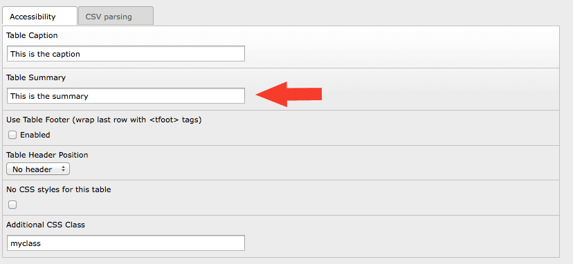

.. ==================================================
.. FOR YOUR INFORMATION
.. --------------------------------------------------
.. -*- coding: utf-8 -*- with BOM.

.. include:: ../../Includes.txt

Using XPATH to read Flexform values
^^^^^^^^^^^^^^^^^^^^^^^^^^^^^^^^^^^

This tutorial shows you how you can use the XPATH content object to
read XML data from a database field and retrieve values from a TYPO3
Flexform without much hazzle. Lets say we want to get the value of the
summary attribute of a table content element:

   Flexform of the table content element

Let's have a look at this Flexform's XML data to locate the value we
are targeting:

.. code-block:: xml

   <?xml version="1.0" encoding="utf-8" standalone="yes" ?>
   <T3FlexForms>
       <data>
           <sheet index="sDEF">
               <language index="lDEF">
                   <field index="acctables_caption">
                       <value index="vDEF">This is the caption</value>
                   </field>
                   <field index="acctables_summary">
                       <value index="vDEF">This is the summary</value>
                   </field>
                   <field index="acctables_tfoot">
                       <value index="vDEF">0</value>
                   </field>
                   <field index="acctables_headerpos">
                       <value index="vDEF"></value>
                   </field>
                   <field index="acctables_nostyles">
                       <value index="vDEF">0</value>
                   </field>
                   <field index="acctables_tableclass">
                       <value index="vDEF">myclass</value>
                   </field>
               </language>
           </sheet>
           <sheet index="s_parsing">
               <language index="lDEF">
                   <field index="tableparsing_quote">
                       <value index="vDEF"></value>
                   </field>
                   <field index="tableparsing_delimiter">
                       <value index="vDEF">124</value>
                   </field>
               </language>
           </sheet>
       </data>
   </T3FlexForms>

For retrieving the value, we need to match the index attribute of the
<field> tag and then get to the atomic node of the <value> tag using
it's index attribute. Our TypoScript looks as follows:

::

   page.10 = XPATH
   page.10 {

     source.data = DB:tt_content:2:pi_flexform

     return = string

     expression = //field[@index='acctables_summary']/value

     resultObj {
       cObjNum = 1
       1.current = 1
       1.wrap = 
<em>|</em>

     }
   }

Using stdWrap on the source property gets us the content element. The
XPATH expression targets the atomic node in the Flexform. Of course
everything could have been made much more flexible. But that's for you
to try out ;)
