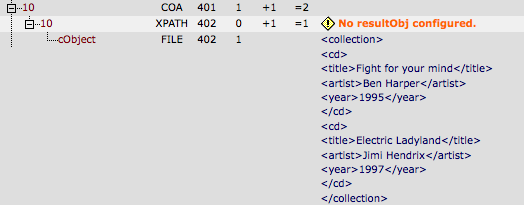
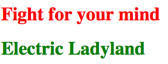

.. ==================================================
.. FOR YOUR INFORMATION
.. --------------------------------------------------
.. -*- coding: utf-8 -*- with BOM.

.. include:: ../../Includes.txt

XPATH and stdWrap
^^^^^^^^^^^^^^^^^

Let's explain some basic techniques for selecting nodes from an XML
source and afterwards displaying them in the FE using stdWrap. We have
the following XML file:

.. code-block:: xml

   <?xml version="1.0"?>
   <collection>
    <cd>
      <title>Fight for your mind</title>
      <artist>Ben Harper</artist>
      <year>1995</year>
    </cd>
    <cd>
      <title>Electric Ladyland</title>
      <artist>Jimi Hendrix</artist>
      <year>1997</year>
    </cd>
   </collection>

We now want to select all CD titles and display them using alternative
colors. We decide to load the source using the FLUIDTEMPLATE object
within our XPATH object. The XPATH expression for selecting all title
attributes within the document is simply: //title. Since the titles
are atomic node values, we decide to return our result as strings.
We end up with the following TypoScript:

::

   page.10 = COA
   page.10 {

     10 = XPATH
     10 {
        source.cObject = FLUIDTEMPLATE
        source.cObject.file = fileadmin/xpath/collection.xml

        expression = //title

        return = string
     }
   }

We have used source's stdWrap properties to apply a FILE object that
loads the contents of our XML file from fileadmin. But wait, something
is wrong, we don't see anything on the website yet... Let's check
what's wrong with the TSFE admin panel.

   XPATH object debug output in TSFE Admin Panel

As we can see from the debug output, loading the XML data was
successful but we forgot to configure a resultObj for the XPATH query.
The resultObj is a key component of the XPATH object. Since each XPATH
query returns an array of matches, we need an instrument to process
the results. So it is a bit like using renderObj for CONTENT elements.
The resultObj property works similar to the TypoScript split property
and has the same subproperties. That provides us with a flexible tool
for handling our results.

Let's output the first title in red, the second in green. The
resultObj for doing that looks like this:

::

   page.10 = COA
   page.10 {

     10 = XPATH
     10 {
        source.cObject = FILE
        source.cObject.file = fileadmin/xpath/collection.xml

        expression = //title

        return = string

        resultObj {
           cObjNum = 1 || 2

           1.current = 1
           1.wrap = <h1 style="color:red;">|</h1>

           2.current = 1
           2.wrap = <h1 style="color:green;">|</h1>
        }
      }
   }

The option split determines that the first match is treated with
object 1, the rest with object 2. This makes it possible to configure
different wraps for our atomic node values. And here it is in all it's
beauty:

