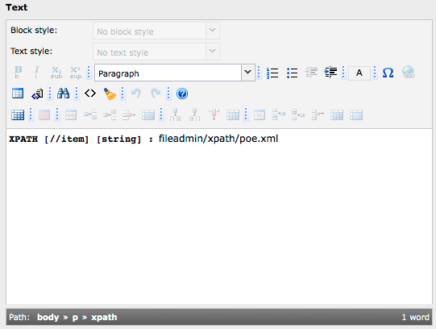
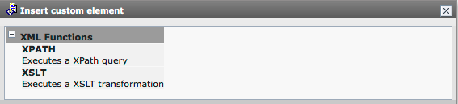
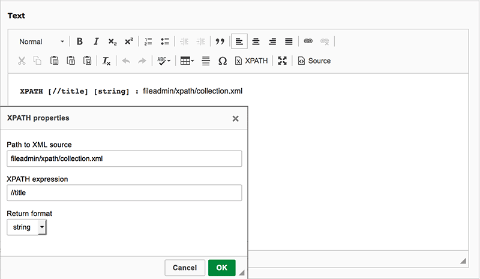

.. ==================================================
.. FOR YOUR INFORMATION
.. --------------------------------------------------
.. -*- coding: utf-8 -*- with BOM.

.. include:: ../../Includes.txt

<xpath> TypoTag
^^^^^^^^^^^^^^

From a developers point of view using the XPATH content object in a
TypoScript template or in a FLUIDTEMPLATE is nice. But
imagine you have some power users that work with XML and wantto select values
themselves. In this tutorial, we will look how to do this with an <xpath> TypoTag.
The obvious advantage of a TypoTag in comparison to other approaches is that
it can be used everywhere in the system. You can also use it in a news record or
an address element for example.

.. attention::

   TYPO3 7.6 and 8.7-10.4 use different rich text editors (rtehtmlarea and ckeditor).
   The configuration therefore depends on your TYPO3 version and the RTE you use. The
   tutorial will first discuss the general setup of the TypoTag and then show the
   respective configurations for the two RTEs.

Configuration for a simple input field (TYPO3 7.6 and 8.7-10.4)
---------------------------------------------------------------

The configuration for a simple input field without RTE works the same for both TYPO3 versions
and is also the basis for the integration of the TypoTag into the respective RTE.

The XPATH TypoTag works similar to a <link> TypoTag and will look like this:

::

     <xpath expression="//title" return="string">fileadmin/xpath/collection.xml</xpath>

To make it work, the content of the field should be treated by a parseFunc. If you output the field
with Fluid you simply send the content through <f:format.html>.

::

   <f:format.html>
      {data.myField}
   </f:format.html>

If you treat the field output with TypoScript, you have to send the content through lib.parseFunc

::

   my.field.stdWrap.parseFunc < lib.parseFunc

The approaches shown here use the standard lib.parseFunc that has to be modified like this with TypoScript:

::

   # allow tag in parseFunc
   lib.parseFunc {
     allowTags := addToList(xpath)
   }

   # allow tag in parseFunc_RTE
   lib.parseFunc_RTE {
     allowTags := addToList(xpath)
   }

   lib.parseFunc.tags.xpath = XPATH
   lib.parseFunc.tags.xpath {

     # tag is breaking up nonTypoTag content, content after must be re-wrapped
     breakoutTypoTagContent = 1

     # strip new lines before and after the tag
     stripNL = 1

     # get current content of tag as source (either XML or a path)
     source.data = current : 1

     # get the Xpath expression from the expression attribute of the tag
     expression.data = parameters : expression

     # get the return format from the format attribute of the tag
     return.data = parameters : return

     # configuration of the result
     resultObj = 1
     resultObj.cObjNum = 1
     resultObj.1.current = 1
   }

   # add tag to parseFunc
   lib.parseFunc_RTE.tags.xpath < lib.parseFunc.tags.xpath

   # add it to the RTE version of parseFunc
   lib.parseFunc_RTE.tags.xpath < lib.parseFunc.tags.xpath

First we add the <xpath> tag to the allowTags lists of both parsing
libraries. Then we configure the tag. Notice that its
important to set the breakoutTypoTagContent property, otherwise you
will have 
s wrapped around your result. Another thing to remember
is that it is possible to get the attribute values of custom tags with
getText from the $cobj->parameters array. And that's it. Now you have
a fully fledged XPATH object at your editor's fingertips.

Note: Of course you can define your own parseFunc. Simply don't forget to send your
field content through it.

Configuration for rtehtmlarea (TYPO3 7.6)
-----------------------------------------

In rtehtmlarea the custom tag will look like this:

A user simply writes the path to the XML file that should be processed by a stylesheet into the
RTE field. The <xpath> tag is then wrapped around it with a user element:

This is the PageTSconfig for achieving the user element:

::

   RTE.default {

           showButtons := addToList(user)
           hideButtons := removeFromList(user)

           userElements {
                   747 = XML Functions
                   747 {
                           10 = XPATH
                           10.description = Executes an XPATH expression
                           10.mode = wrap
                           10.content = <xpath expression="//item" return="string">|</xpath>
                   }
           }

           proc {
                   allowTagsOutside := addToList(xpath)
                   allowTags := addToList(xpath)
                   entryHTMLparser_db {
                           htmlSpecialChars = -1
                           allowTags := addToList(xpath)
                   }
           }
   }

Notice: It is not possible to set attributes with a user element. Therefore you will
have to set a fixed expression and return value for each <xpath> user element you define.

Configuration for ckeditor (TYPO3 8.7-10.4)
-------------------------------------------

From this version onwards CKEditor is the new default RTE. Note that you can still use rtehtmlarea in TYPO3 8.7
but it is now a separate extension in TER. The integration of the <xpath> TypoTag into CKEditor is fully backwards
compatible to the rtehtmlarea integration. It looks like this:

CKEditor has a neat feature: A dialog in which the user can insert the path to the
XML source, the XPATH expression and a select box with the return value.

The configuration works with YAML files and presets that can be specified for fields or branches
of the page tree with PageTSConfig. By default the RTE gives you the "minimal", "default" and "full" presets.

If you want to integrate the <xpath> TypoTag into your CKEditor you have to build a new YAML preset in an extension
and activate it with PageTSConfig. cobj_xpath provides an example configuration. It is based on the "default"
preset of CKEditor and you can include it with one line of TypoScript:

::

  RTE.default.preset = cobj_xpath

If you have defined your own preset you need to add the following to your YAML configuration:

::

  # register the <xpath> plugin with CKEditor
  editor:
    externalPlugins:
      xpath: { resource: "EXT:cobj_xpath/Resources/Public/JavaScript/Plugins/xpath/plugin.js" }

  # register <xpath> tag with RTE processing
  processing:
    allowTags:
      - list of your other allowed tags
      - xpath

    allowTagsOutside: [list of your tags, xpath]

    HTMLparser_db:
      allowTags: [xpath]

And a bit of CSS
----------------

To get a nicer display of the new tag in the RTE you can include the following
CSS rule in the contentCSS file that you load with either rtehtmlarea or CKEditor:

::

   xpath:before {
           content: "XPATH ["attr(expression)"] ["attr(return)"] :";
           display: inline-block;
           padding: 0 0.5em 0 0;
           font-family: monospace;
           font-weight: bold;
   }

We are using the :before pseudo-selector and the content property in combination with
CSS's attr() function to display the expression and the return value that is set with each <xpath> TypoTag.
